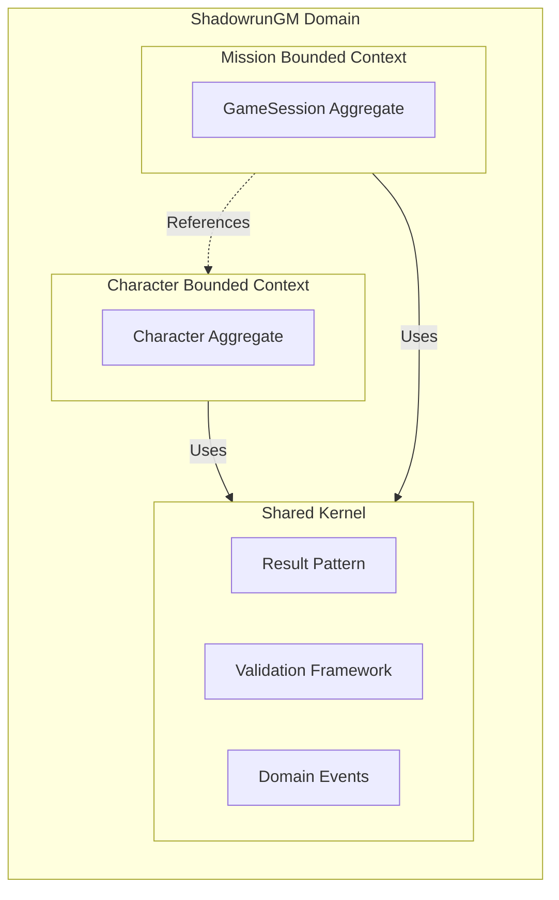
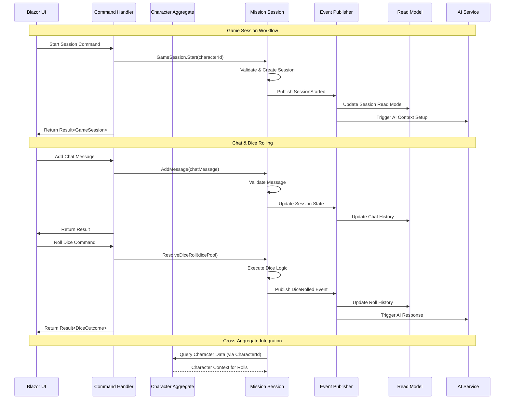

# Domain Architecture

## Overview

The ShadowrunGM domain layer follows Domain-Driven Design principles with clearly defined aggregates, value objects, and domain events.

## Aggregate Map

## Bounded Contexts

### Character Bounded Context

**Primary Aggregate:** Character

**Responsibilities:**
- Character creation and management
- Attribute and skill tracking
- Edge point management and spending
- Condition monitor (health tracking)
- Augmentation and equipment management

**Key Value Objects:**
- CharacterId, AttributeSet, Edge, ConditionMonitor, Skill

**Domain Events:**
- CharacterCreated, EdgeSpent, EdgeRegained, PhysicalDamageTaken, StunDamageTaken

### Mission Bounded Context

**Primary Aggregate:** GameSession

**Responsibilities:**
- Game session lifecycle management (start, pause, resume, complete)
- Real-time chat message handling between players and AI GM
- Shadowrun dice rolling mechanics and outcome tracking
- Session history and audit trail maintenance

**Key Value Objects:**
- SessionId, ChatMessage, DicePool, DiceOutcome, DiceRoll

**Domain Services:**
- IDiceService (dice rolling algorithms)

**Domain Events:**
- SessionStarted, SessionPaused, SessionResumed, SessionCompleted, DiceRolled

**Integration Points:**
- References Character aggregate via CharacterId
- Uses shared Result<T> pattern for validation and error handling

### Shared Kernel

**Components:**
- **Result<T> Pattern:** Comprehensive error handling with success/failure semantics
- **Validation Framework:** Fluent validation with Result<T> integration
- **Domain Events:** Base classes and infrastructure for event-driven architecture
- **Value Object Base Classes:** Common infrastructure for immutable domain concepts

## Domain Events Flow

## Integration Patterns

### CQRS (Command Query Responsibility Segregation)
- **Commands:** Modify aggregates through command handlers, return Result<T> for success/failure
- **Queries:** Read from optimized models, separate from write operations
- **Handlers:** Thin orchestration layer coordinating domain operations

### Event-Driven Architecture
- **Domain Events:** Published by aggregates for state changes and cross-context integration
- **Event Handlers:** Process domain events to update read models and trigger integrations
- **Eventual Consistency:** Bounded contexts sync via events rather than direct references

### Result Pattern Integration
- **Comprehensive Error Handling:** All operations return Result<T> with typed failure reasons
- **Validation Framework:** Fluent validation integrated with Result<T> composition
- **HTTP Integration:** Automatic Result<T> to HTTP response conversion

### Aggregate Design Patterns
- **Identity References:** Aggregates reference others by ID, not direct object references
- **Factory Methods:** Complex creation logic encapsulated in static factory methods
- **Domain Services:** Cross-aggregate logic (like dice rolling) handled by domain services
- **Value Objects:** Immutable domain concepts with behavior and validation

### Cross-Context Communication
- **Weak References:** Mission aggregate holds CharacterId, not full Character object
- **Event Integration:** Domain events enable loose coupling between contexts
- **Repository Abstraction:** Cross-aggregate queries go through repository interfaces

---

*Updated with Mission Bounded Context on 2025-08-30*
