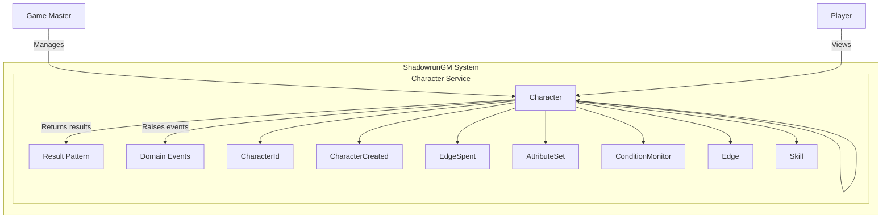
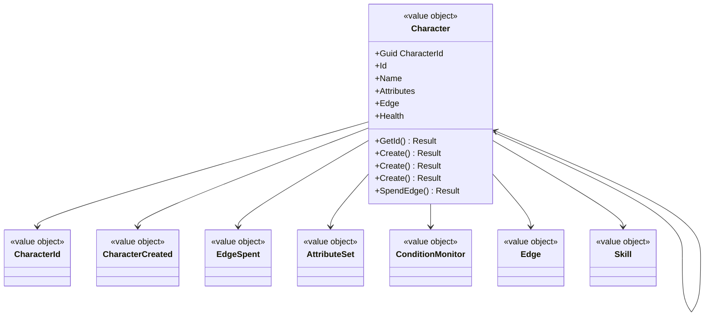

# Character Aggregate Documentation

This document provides a comprehensive overview of the **Character** aggregate, including:

- A high-level C4-like Mermaid diagram
- Domain-level modeling
- Domain-Driven Design (DDD) glossary
- Behavior and lifecycle overview
- Guidance on where to find relevant code and tests

---

## High-Level Architectural View (C4-Like Diagram)

The diagram above shows how the `Character` aggregate interacts with other components in the domain. Note that this is a simplified component-level representation (akin to a Level 3 C4 diagram).

### System Context (Level 1)
The **Character Service** is part of the larger **ShadowrunGM System**. External users interact with the system through:
- **Game Master:** Primary user who manages character entities
- **Players:** Secondary users who may interact with character data

### Container Level (Level 2)
**Character Service** components:
- **Web Application (UI):** Blazor WebAssembly interface for character management
- **Character Service (API):** ASP.NET Core backend with CQRS and DDD patterns
- **Database (Write Model):** Stores the `Character` aggregate state and domain events
- **Read Model Store:** Provides query-optimized data for application queries

### Component Level (Level 3)
Within the **Character Service**:
- **Command Handlers:** Execute business operations on Character entities
- **Query Handlers:** Provide read data for Character queries
- **Domain Layer:** `Character` aggregate, states, value objects, and domain events
- **Infrastructure Layer:** Repositories, event publishers, and external service adapters

---

## State Diagram

This aggregate does not use a state machine pattern.

---

## Class Diagram

The following class diagram shows how the `Character` aggregate, states, value objects, and domain events relate to each other:

---

## Domain-Level Modeling

The `Character` aggregate manages character within the ShadowrunGM domain. It ensures business rules are enforced and state transitions occur according to domain logic.

**Key structural elements:**

- **Character (Aggregate Root):** Core entity with identity and business rules
- **Value Objects:** Character, CharacterId, CharacterCreated, EdgeSpent, AttributeSet, ConditionMonitor, Edge, Skill - immutable domain concepts

**Domain Events:** Recorded when significant business events occur, enabling eventual consistency and integration with other bounded contexts.

---

## Domain-Driven Design Glossary

| Term | Definition |
|------|------------|
| **Character** | Represents a player character or NPC in the Shadowrun universe. |
| **Character** | Represents a player character or NPC in the Shadowrun universe. |
| **CharacterId** | Represents a player character or NPC in the Shadowrun universe. |
| **CharacterCreated** | Represents a player character or NPC in the Shadowrun universe. |
| **EdgeSpent** | Domain concept representing edge spent. |
| **AttributeSet** | Domain concept representing attribute set. |
| **ConditionMonitor** | Domain concept representing condition monitor. |
| **Edge** | Domain concept representing edge. |
| **Skill** | Domain concept representing skill. |

---

## Behavior and Lifecycle

**Common operations include:**
- **GetId**: Executes get id operation
- **Create**: Creates a new 
- **Create**: Creates a new 
- **Create**: Creates a new 
- **SpendEdge**: Executes spend edge operation
- **RegainEdge**: Executes regain edge operation
- **RefreshEdge**: Executes refresh edge operation
- **BurnEdge**: Executes burn edge operation
- **TakePhysicalDamage**: Executes take physical damage operation
- **TakeStunDamage**: Executes take stun damage operation
- **HealPhysicalDamage**: Executes heal physical damage operation
- **HealStunDamage**: Executes heal stun damage operation
- **HealAll**: Executes heal all operation
- **AddSkill**: Executes add skill operation
- **UpdateSkill**: Executes update skill operation
- **RemoveSkill**: Executes remove skill operation

---

## Relevant Code and Tests

**Code Structure:**
- **Domain Layer:**
  - `Character.cs`: The aggregate root and core logic
  - `Character.cs`: Value object for character
  - `CharacterId.cs`: Value object for character id
  - `CharacterCreated.cs`: Value object for character created
  - `EdgeSpent.cs`: Value object for edge spent
  - `AttributeSet.cs`: Value object for attribute set
  - `ConditionMonitor.cs`: Value object for condition monitor
  - `Edge.cs`: Value object for edge
  - `Skill.cs`: Value object for skill

**Tests:**
- **Unit Tests:** Validate each method against different states and conditions
- **Integration Tests:** Test full workflows and repository interactions

---

## Additional Resources

- **C4 Model:** [C4Model.com](https://c4model.com) for architectural diagram details
- **DDD Reference:** [Domain-Driven Design by Eric Evans](https://domainlanguage.com/)
- **Project Architecture:** [../architecture/README.md](../architecture/README.md)

---

*Generated by ShadowrunGM Documentation Agent v1.0.0 on 2025-08-30 14:27:18*
