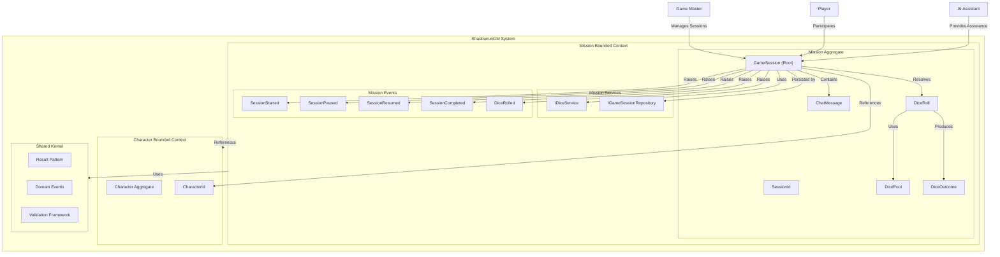
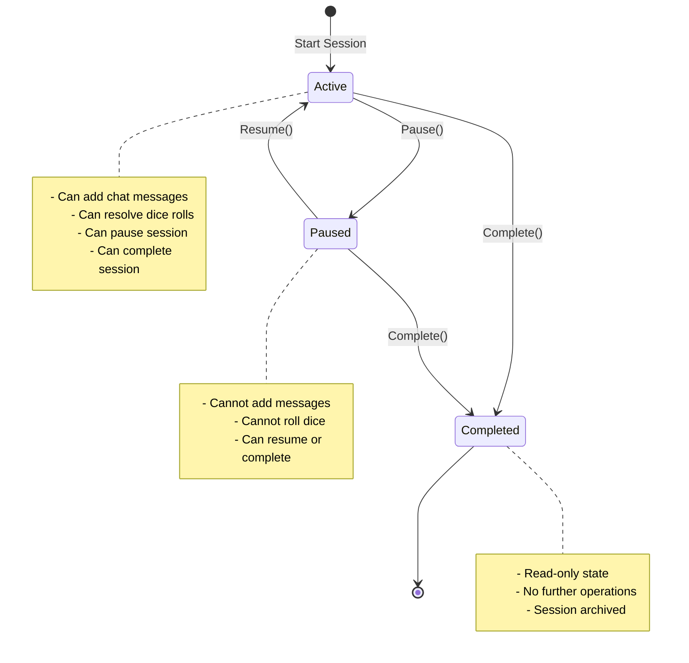
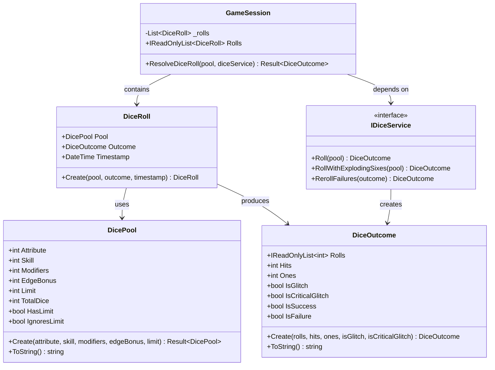
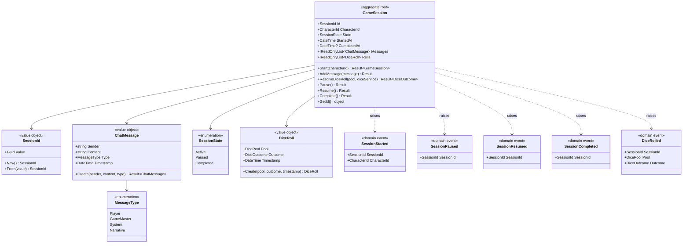
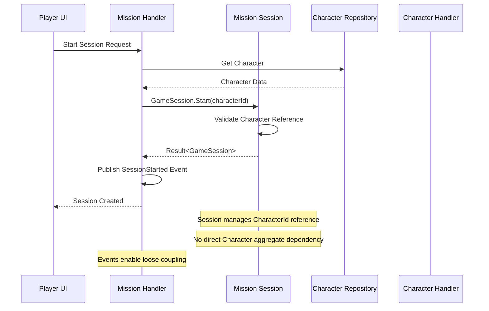

# Mission Aggregate Documentation

This document provides a comprehensive overview of the **Mission** aggregate, including:

- A high-level C4-like Mermaid diagram showing bounded context architecture
- State machine diagrams for SessionState transitions
- Domain-level modeling with dice rolling subsystem
- Domain-Driven Design (DDD) glossary with Shadowrun terminology
- Integration patterns with Character aggregate
- Behavior and lifecycle overview
- Guidance on where to find relevant code and tests

---

## High-Level Architectural View (C4-Like Diagram)

The diagram above shows the Mission bounded context within the ShadowrunGM system. The Mission aggregate manages game sessions, chat interactions, and dice rolling mechanics.

### System Context (Level 1)
The **Mission Bounded Context** is part of the larger **ShadowrunGM System**. External actors interact with the system through:
- **Game Master:** Primary user who manages and controls game sessions
- **Player:** Participates in game sessions through chat and dice rolling
- **AI Assistant:** Provides GM assistance and narrative generation

### Container Level (Level 2)
**Mission Service** components:
- **Web Application (UI):** Blazor WebAssembly interface with chat-centric design for session management
- **Mission Service (API):** ASP.NET Core backend with CQRS handlers for session operations
- **Database (Write Model):** Stores GameSession aggregates, chat messages, and dice roll history
- **Event Store:** Publishes mission domain events for integration with other contexts

### Component Level (Level 3)
Within the **Mission Bounded Context**:
- **Command Handlers:** Execute session operations (start, pause, resume, complete, add messages, roll dice)
- **Query Handlers:** Provide read data for session views and chat history
- **Domain Layer:** GameSession aggregate with chat and dice rolling capabilities
- **Infrastructure Layer:** Session repository, dice service implementation, event publishing

---

## State Machine Diagram

The GameSession aggregate follows a well-defined state machine for session lifecycle management:

### State Transitions and Business Rules

**Active State:**
- Default initial state when session is started
- All operations are allowed: chat messages, dice rolling, state changes
- Primary gameplay state for ongoing sessions

**Paused State:**
- Entered via `Pause()` command from Active state
- Gameplay operations (messages, dice) are blocked
- Can transition to Active (Resume) or Completed states
- Used for temporary breaks or session management

**Completed State:**
- Terminal state - no further transitions possible
- Can be entered from either Active or Paused states
- All gameplay operations are permanently disabled
- Session data becomes read-only for historical reference

---

## Dice Rolling Subsystem Architecture

The Mission aggregate includes a sophisticated dice rolling subsystem that implements Shadowrun 6th Edition mechanics:

### Shadowrun Dice Mechanics

The dice rolling system implements authentic Shadowrun 6th Edition rules:

**Dice Pool Construction:**
- **Attribute + Skill:** Base dice pool from character attributes and skill ratings
- **Modifiers:** Situational modifiers (positive/negative) from environmental factors
- **Edge Bonus:** Additional dice when spending Edge points
- **Limit:** Maximum hits that can count (unless Edge is used to ignore limits)

**Roll Resolution:**
- Roll pool of six-sided dice (d6)
- **Hits:** Count 5s and 6s as successes
- **Ones:** Track for glitch determination
- **Glitch:** More than half the dice show 1s (reduces effectiveness)
- **Critical Glitch:** Glitch with zero hits (catastrophic failure)

**Edge Rules:**
- **Exploding Sixes:** When using Edge, 6s generate additional dice
- **Ignore Limits:** Edge can remove hit limits from tests
- **Reroll Failures:** Edge allows rerolling non-hit dice

---

## Class Diagram

The following class diagram shows the complete Mission aggregate structure and relationships:

---

## Domain-Level Modeling

The **Mission** aggregate manages game sessions within the ShadowrunGM domain. It orchestrates real-time chat interactions, dice rolling mechanics, and session lifecycle management while ensuring business rules are enforced and state transitions occur according to domain logic.

**Key structural elements:**

**Aggregate Root:**
- **GameSession:** Central entity managing session state, chat history, and dice roll records
- Coordinates all mission-related operations and maintains consistency boundaries
- Publishes domain events for integration with other bounded contexts

**Value Objects:**
- **SessionId:** Strongly-typed identifier for game sessions
- **ChatMessage:** Immutable message records with sender, content, type, and timestamp
- **DicePool:** Encapsulates Shadowrun dice mechanics with validation
- **DiceOutcome:** Immutable results of dice rolls including hits, glitches, and individual die results
- **DiceRoll:** Historical record combining pool, outcome, and timestamp

**Domain Events:** 
- **SessionStarted:** New session initiated with character association
- **SessionPaused/Resumed:** Session state management events
- **SessionCompleted:** Session termination event
- **DiceRolled:** Dice resolution event with full context for game tracking

**Domain Services:**
- **IDiceService:** Encapsulates dice rolling algorithms and Shadowrun-specific rules
- **IGameSessionRepository:** Persistence abstraction for session aggregates

---

## Domain-Driven Design Glossary

| Term | Definition |
|------|------------|
| **Game Session** | A bounded period of gameplay interaction between players and GM, managing chat, dice rolls, and narrative flow. |
| **Session State** | The lifecycle state of a game session (Active, Paused, Completed) determining available operations. |
| **Chat Message** | A communication record in a session with sender identification, content, type classification, and timestamp. |
| **Dice Pool** | A collection of six-sided dice for Shadowrun tests, composed of attribute, skill, modifiers, and Edge bonuses. |
| **Dice Outcome** | The resolved result of a dice pool roll, including hits, glitches, and individual die results. |
| **Dice Roll** | A historical record combining the dice pool used and the outcome produced. |
| **Hit** | A successful die result (5 or 6 on a d6) in Shadowrun dice mechanics. |
| **Glitch** | A complication occurring when more than half the dice show 1s, potentially reducing success effectiveness. |
| **Critical Glitch** | A catastrophic failure combining a glitch with zero hits, representing severe consequences. |
| **Edge** | Shadowrun's luck/karma resource allowing dice pool bonuses, rerolls, and limit ignoring. |
| **Limit** | The maximum number of hits that can count toward success unless Edge is used to ignore limits. |
| **Exploding Sixes** | Edge rule where 6s generate additional dice to roll. |
| **Message Type** | Classification of chat messages (Player, GameMaster, System, Narrative) for UI presentation. |
| **Session Lifecycle** | The managed progression of a game session through Active, Paused, and Completed states. |
| **Domain Service** | Encapsulation of domain logic that doesn't naturally belong to a single entity or value object. |

---

## Integration Patterns with Character Aggregate

The Mission aggregate integrates with the Character aggregate through well-defined patterns:

**Key Integration Patterns:**

1. **Reference by Identity:** Mission aggregate holds `CharacterId` references rather than full Character entities
2. **Event-Driven Integration:** Domain events enable eventual consistency between aggregates
3. **Bounded Context Isolation:** Each aggregate maintains its own consistency boundary
4. **Repository Mediation:** Cross-aggregate queries go through repository abstractions

---

## Behavior and Lifecycle

**Session Management Operations:**
- **Start:** Creates new session with character association and Active state
- **AddMessage:** Appends chat messages to session history (Active state only)
- **ResolveDiceRoll:** Processes dice pools through dice service and records results
- **Pause:** Transitions to Paused state, blocking gameplay operations
- **Resume:** Returns to Active state from Paused, enabling gameplay
- **Complete:** Transitions to terminal Completed state, finalizing session

**Dice Rolling Operations:**
- **Standard Roll:** Basic dice pool resolution with hit/glitch calculation
- **Edge-Enhanced Roll:** Exploding sixes and limit ignoring for Edge usage
- **Failure Reroll:** Edge rule allowing rerolling of failed dice

**Chat Operations:**
- **Player Messages:** User input captured with sender identification
- **GM Messages:** AI-generated responses and narrative content
- **System Messages:** Automated notifications for dice results and game events
- **Narrative Messages:** Descriptive content for scene setting

**Event Publication:**
- All state changes publish appropriate domain events
- Events include full context for downstream processing
- Enables integration with read models and external systems

---

## Relevant Code and Tests

**Code Structure:**
- **Domain Layer:**
  - `GameSession.cs`: Aggregate root with session management logic
  - `SessionId.cs`: Strong identifier for sessions
  - `ValueObjects/ChatMessage.cs`: Immutable message representation
  - `ValueObjects/DicePool.cs`: Shadowrun dice mechanics encapsulation
  - `ValueObjects/DiceOutcome.cs`: Dice roll result representation
  - `ValueObjects/DiceRoll.cs`: Historical dice roll record
  - `Events/SessionStarted.cs`: Session initiation event
  - `Events/SessionPaused.cs`: Session pause event
  - `Events/SessionResumed.cs`: Session resume event
  - `Events/SessionCompleted.cs`: Session completion event
  - `Events/DiceRolled.cs`: Dice roll event
  - `IDiceService.cs`: Dice rolling domain service interface
  - `IGameSessionRepository.cs`: Session persistence abstraction

**Application Layer:**
  - Command handlers for session operations
  - Query handlers for session data retrieval
  - Validation rules for mission domain operations

**Infrastructure Layer:**
  - Dice service implementation with random number generation
  - Entity Framework session repository implementation
  - Event publishing infrastructure

**Tests:**
- **Unit Tests:** Validate aggregate behavior, value object creation, and business rule enforcement
- **Integration Tests:** Test full session workflows and repository interactions
- **Domain Tests:** Verify dice mechanics accuracy and edge case handling

---

## Additional Resources

- **C4 Model:** [C4Model.com](https://c4model.com) for architectural diagram details
- **DDD Reference:** [Domain-Driven Design by Eric Evans](https://domainlanguage.com/)
- **Shadowrun 6E Rules:** Core rulebook dice mechanics and Edge rules
- **Project Architecture:** [../architecture/domain-architecture.md](../architecture/domain-architecture.md)
- **Character Integration:** [character-aggregate.md](character-aggregate.md)

---

*Generated by ShadowrunGM Documentation Agent v1.0.0 on 2025-08-30*