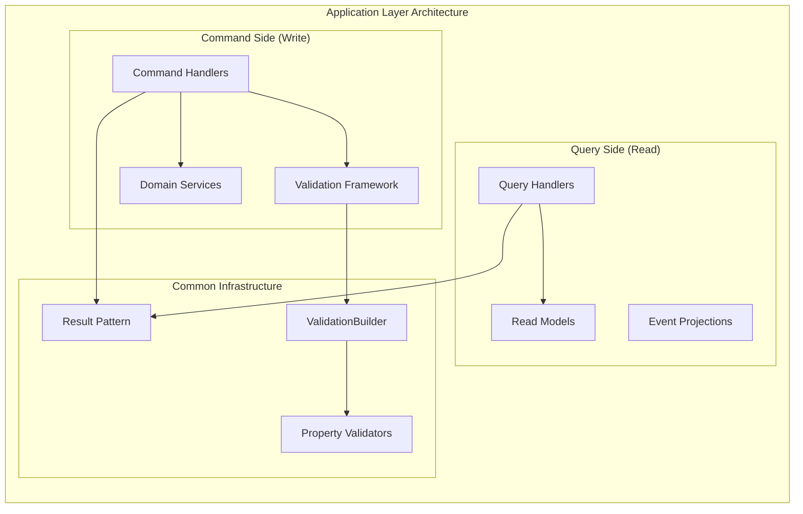

# Application Layer

The Application layer serves as the orchestration layer between the domain and infrastructure, implementing Command Query Responsibility Segregation (CQRS) patterns with comprehensive validation and error handling through the Result&lt;T&gt; pattern.

## Architecture Overview



## CQRS Implementation Patterns

The ShadowrunGM application implements CQRS through a custom pattern built on the ApiSdk infrastructure:

### Command Pattern

```csharp
// Command Definition
public sealed record CreateCharacterCommand(
    string Name,
    AttributeSet Attributes,
    int StartingEdge) : ICommand<CharacterId>;

// Command Handler Implementation
public sealed class CreateCharacterCommandHandler : ICommandHandler<CreateCharacterCommand, CharacterId>
{
    private readonly ICharacterRepository _repository;

    public CreateCharacterCommandHandler(ICharacterRepository repository) =>
        _repository = repository;

    public async Task<Result<CharacterId>> HandleAsync(CreateCharacterCommand command, CancellationToken cancellationToken)
    {
        // 1. Domain validation through ValidationBuilder
        Result<Character> characterResult = new ValidationBuilder<Character>()
            .RuleFor(x => x.Name, command.Name)
                .NotEmpty()
                .MaximumLength(100)
            .RuleFor(x => x.Attributes, AttributeSet.Create(command.Attributes), out AttributeSet? validatedAttributes)
            .RuleFor(x => x.Edge, Edge.Create(command.StartingEdge), out Edge? validatedEdge)
            .Build(() => Character.Create(command.Name, validatedAttributes!, validatedEdge!));

        if (characterResult.IsFailure)
            return Result.Failure<CharacterId>(characterResult.Error);

        // 2. Persistence through repository
        Character character = characterResult.Value!;
        await _repository.AddAsync(character, cancellationToken);

        // 3. Return strongly-typed identifier
        return Result.Success(character.Id);
    }
}
```

### Query Pattern

```csharp
// Query Definition
public sealed record GetCharacterQuery(CharacterId Id) : IQuery<CharacterDetailsDto>;

// Query Handler Implementation  
public sealed class GetCharacterQueryHandler : IQueryHandler<GetCharacterQuery, CharacterDetailsDto>
{
    private readonly ICharacterReadRepository _repository;

    public GetCharacterQueryHandler(ICharacterReadRepository repository) =>
        _repository = repository;

    public async Task<Result<CharacterDetailsDto>> HandleAsync(GetCharacterQuery query, CancellationToken cancellationToken)
    {
        CharacterDetailsDto? character = await _repository.GetCharacterDetailsAsync(query.Id, cancellationToken);
        
        return character is not null
            ? Result.Success(character)
            : Result.Failure<CharacterDetailsDto>($"Character with ID {query.Id} not found");
    }
}
```

## Validation Framework Integration

The Application layer leverages a comprehensive validation framework that integrates seamlessly with the Result&lt;T&gt; pattern:

### Basic Validation Patterns

```csharp
public async Task<Result<GameSession>> StartSessionCommandHandler(StartSessionCommand command)
{
    // Validate command parameters with fluent syntax
    ValidationBuilder<GameSession> builder = new();
    
    Result<GameSession> sessionResult = builder
        .RuleFor(x => x.CharacterId, command.CharacterId)
            .NotEqual(Guid.Empty)
            .WithMessage("Character ID is required")
        .RuleFor(x => x.SessionName, command.SessionName)
            .NotEmpty()
            .MaximumLength(100)
            .WithMessage("Session name must be between 1 and 100 characters")
        .Build(() => GameSession.Start(command.CharacterId));

    if (sessionResult.IsFailure)
        return sessionResult;

    // Proceed with business logic...
    GameSession session = sessionResult.Value!;
    await _repository.AddAsync(session);
    
    return Result.Success(session);
}
```

### Result&lt;T&gt; Composition Patterns

```csharp
// Compose multiple validation operations
public async Task<Result<DiceOutcome>> RollDiceCommandHandler(RollDiceCommand command)
{
    ValidationBuilder<DiceOutcome> builder = new();
    
    return builder
        // Validate dice pool creation (nested Result<T>)
        .RuleFor(x => x.Pool, DicePool.Create(command.Attribute, command.Skill, command.Modifiers), out DicePool? dicePool)
        
        // Validate session exists and is active
        .RuleFor(x => x.Session, await ValidateActiveSession(command.SessionId), out GameSession? session)
        
        // Execute domain operation if all validations pass
        .Build(() => session!.ResolveDiceRoll(dicePool!, _diceService));
}

private async Task<Result<GameSession>> ValidateActiveSession(SessionId sessionId)
{
    GameSession? session = await _repository.GetByIdAsync(sessionId);
    
    return session switch
    {
        null => Result.Failure<GameSession>("Session not found"),
        { State: SessionState.Completed } => Result.Failure<GameSession>("Cannot perform actions on completed session"),
        { State: SessionState.Paused } => Result.Failure<GameSession>("Session is currently paused"),
        _ => Result.Success(session)
    };
}
```

## Handler Guidelines and Conventions

### Command Handler Structure

```csharp
public sealed class ExampleCommandHandler : ICommandHandler<ExampleCommand, ExampleResult>
{
    #region Private Members
    private readonly IRepository _repository;
    private readonly IDomainService _domainService;
    #endregion

    #region Public Constructors  
    public ExampleCommandHandler(IRepository repository, IDomainService domainService)
    {
        _repository = repository;
        _domainService = domainService;
    }
    #endregion

    #region Public Methods
    public async Task<Result<ExampleResult>> HandleAsync(ExampleCommand command, CancellationToken cancellationToken)
    {
        // 1. Input Validation (using ValidationBuilder)
        Result<DomainEntity> validationResult = ValidateCommand(command);
        if (validationResult.IsFailure)
            return Result.Failure<ExampleResult>(validationResult.Error);

        // 2. Domain Operation
        DomainEntity entity = validationResult.Value!;
        Result<DomainEvent> domainResult = entity.PerformOperation();
        if (domainResult.IsFailure)
            return Result.Failure<ExampleResult>(domainResult.Error);

        // 3. Persistence
        await _repository.SaveAsync(entity, cancellationToken);

        // 4. Return Result
        return Result.Success(new ExampleResult(entity.Id));
    }
    #endregion

    #region Private Methods
    private Result<DomainEntity> ValidateCommand(ExampleCommand command) =>
        new ValidationBuilder<DomainEntity>()
            .RuleFor(x => x.Property, command.Value)
                .NotEmpty()
                .MaximumLength(50)
            .Build(() => new DomainEntity(command.Value));
    #endregion
}
```

### Query Handler Structure

```csharp
public sealed class ExampleQueryHandler : IQueryHandler<ExampleQuery, ExampleDto>
{
    #region Private Members
    private readonly IReadRepository _repository;
    #endregion

    #region Public Constructors
    public ExampleQueryHandler(IReadRepository repository) =>
        _repository = repository;
    #endregion

    #region Public Methods
    public async Task<Result<ExampleDto>> HandleAsync(ExampleQuery query, CancellationToken cancellationToken)
    {
        // 1. Input Validation (minimal for queries)
        if (query.Id == Guid.Empty)
            return Result.Failure<ExampleDto>("Invalid ID provided");

        // 2. Data Retrieval
        ExampleDto? result = await _repository.GetByIdAsync(query.Id, cancellationToken);

        // 3. Return Result
        return result is not null
            ? Result.Success(result)
            : Result.Failure<ExampleDto>("Entity not found");
    }
    #endregion
}
```

## Error Handling Patterns

### Validation Error Aggregation

```csharp
// Multiple validation rules with custom error messages
Result<Character> characterResult = new ValidationBuilder<Character>()
    .RuleFor(x => x.Name, request.Name)
        .NotEmpty()
        .WithMessage("Character name is required")
        .MaximumLength(100)
        .WithMessage("Character name cannot exceed 100 characters")
    .RuleFor(x => x.Email, request.Email)
        .EmailAddress()
        .WithMessage("Please provide a valid email address")
    .RuleFor(x => x.Age, request.Age)
        .InclusiveBetween(1, 1000)
        .WithMessage("Character age must be between 1 and 1000 years")
    .Build(() => new Character(request.Name, request.Email, request.Age));

// Automatic error aggregation for HTTP responses
return characterResult.Match(
    onSuccess: character => Ok(character),
    onValidationException: errors => BadRequest(errors)); // Automatic validation error formatting
```

### Domain Error Handling

```csharp
// Domain-specific error handling
public async Task<Result<EdgeSpentEvent>> SpendEdgeCommandHandler(SpendEdgeCommand command)
{
    Character character = await _repository.GetByIdAsync(command.CharacterId);
    if (character is null)
        return Result.Failure<EdgeSpentEvent>("Character not found");

    // Domain operation with specific error handling
    Result<EdgeSpentEvent> spendResult = character.SpendEdge(command.Amount, command.Purpose);
    
    return spendResult.Match(
        onSuccess: edgeEvent =>
        {
            // Success path
            _repository.SaveAsync(character);
            return Result.Success(edgeEvent);
        },
        onError: error => Result.Failure<EdgeSpentEvent>($"Edge spending failed: {error}"),
        onValidationException: errors => Result.Failure<EdgeSpentEvent>(errors));
}
```

## Integration with Domain Layer

### Aggregate Coordination

```csharp
// Cross-aggregate operations through application services
public sealed class MissionOrchestrator
{
    private readonly IGameSessionRepository _sessionRepository;
    private readonly ICharacterRepository _characterRepository;
    private readonly IDiceService _diceService;

    public async Task<Result<DiceOutcome>> ProcessDiceRollWithCharacterContext(
        SessionId sessionId, 
        DiceRollRequest request)
    {
        // 1. Retrieve session aggregate
        GameSession? session = await _sessionRepository.GetByIdAsync(sessionId);
        if (session is null)
            return Result.Failure<DiceOutcome>("Session not found");

        // 2. Retrieve character context (separate aggregate)
        Character? character = await _characterRepository.GetByIdAsync(session.CharacterId);
        if (character is null)
            return Result.Failure<DiceOutcome>("Character not found");

        // 3. Build dice pool using character attributes
        Result<DicePool> poolResult = DicePool.Create(
            attribute: character.GetAttributeValue(request.AttributeType),
            skill: character.GetSkillRating(request.SkillName),
            modifiers: request.Modifiers);

        if (poolResult.IsFailure)
            return Result.Failure<DiceOutcome>(poolResult.Error);

        // 4. Execute dice roll through session aggregate
        return session.ResolveDiceRoll(poolResult.Value!, _diceService);
    }
}
```

## Available Validation Rules Reference

### String Validation
- `NotEmpty()` - Ensures non-null, non-empty strings
- `MinimumLength(int)` / `MaximumLength(int)` - Length constraints
- `ExactLength(int)` - Exact length requirement
- `Length(int, int)` - Range-based length validation
- `EmailAddress()` - Email format validation
- `Matches(string, RegexOptions?)` - Regular expression matching

### Numeric Validation
- `GreaterThan(T)` / `GreaterThanOrEqualTo(T)` - Lower bound validation
- `LessThan(T)` / `LessThanOrEqualTo(T)` - Upper bound validation
- `InclusiveBetween(int, int)` / `ExclusiveBetween(int, int)` - Range validation
- `PrecisionScale(int, int)` - Decimal precision validation

### Collection Validation
- `NotEmpty()` - Ensures collections have items
- `MinCount(int)` / `MaxCount(int)` - Size constraints
- `Count(int)` - Exact count requirement
- `Unique()` - Ensures all items are distinct

### General Validation
- `NotNull()` / `Null()` - Null checking
- `Equal(T)` / `NotEqual(T)` - Equality comparison
- `Must(Func<T, bool>, string)` - Custom validation logic
- `When(Func<T, bool>)` / `Unless(Func<T, bool>)` - Conditional validation
- `WithMessage(string)` - Custom error messages

### Result&lt;T&gt; Integration
- `RuleFor(expression, Result<T>, out T?)` - Compose nested Result&lt;T&gt; validations
- Automatic error extraction and aggregation
- Out parameter access for successful values

## Testing Strategies

### Command Handler Testing

```csharp
[Test]
public async Task CreateCharacter_WithValidInput_ReturnsSuccess()
{
    // Arrange
    CreateCharacterCommand command = new("Shadowrunner", ValidAttributeSet, 3);
    CreateCharacterCommandHandler handler = new(_mockRepository.Object);

    // Act
    Result<CharacterId> result = await handler.HandleAsync(command, CancellationToken.None);

    // Assert
    result.IsSuccess.Should().BeTrue();
    result.Value.Should().NotBe(Guid.Empty);
    _mockRepository.Verify(r => r.AddAsync(It.IsAny<Character>(), It.IsAny<CancellationToken>()), Times.Once);
}

[Test]
public async Task CreateCharacter_WithInvalidName_ReturnsValidationFailure()
{
    // Arrange
    CreateCharacterCommand command = new("", ValidAttributeSet, 3); // Invalid empty name
    CreateCharacterCommandHandler handler = new(_mockRepository.Object);

    // Act
    Result<CharacterId> result = await handler.HandleAsync(command, CancellationToken.None);

    // Assert
    result.IsFailure.Should().BeTrue();
    result.Error.Should().Contain("name", StringComparison.OrdinalIgnoreCase);
    _mockRepository.Verify(r => r.AddAsync(It.IsAny<Character>(), It.IsAny<CancellationToken>()), Times.Never);
}
```

### Validation Framework Testing

```csharp
[Test]
public void ValidationBuilder_WithMultipleErrors_AggregatesAllFailures()
{
    // Arrange & Act
    Result<TestEntity> result = new ValidationBuilder<TestEntity>()
        .RuleFor(x => x.Name, "") // Will fail NotEmpty
            .NotEmpty()
        .RuleFor(x => x.Email, "invalid-email") // Will fail EmailAddress
            .EmailAddress()
        .RuleFor(x => x.Age, -1) // Will fail GreaterThan
            .GreaterThan(0)
        .Build(() => new TestEntity());

    // Assert
    result.IsFailure.Should().BeTrue();
    result.ValidationErrors.Should().HaveCount(3);
    result.ValidationErrors.Should().ContainKeys("Name", "Email", "Age");
}
```

## Performance Considerations

### Repository Pattern Optimization
- Use read-optimized projections for queries
- Implement caching strategies for frequently accessed data
- Consider async enumerable for large result sets

### Validation Performance
- ValidationBuilder creates minimal allocations through reuse patterns
- Conditional validation (When/Unless) prevents unnecessary rule execution
- Compiled expressions for property name extraction

### Memory Management
- Handlers are scoped to request lifetime
- Result&lt;T&gt; pattern avoids exception-based control flow
- Validation rules use struct-based implementations where possible

---

*ShadowrunGM Application Layer Documentation - Generated 2025-08-30*